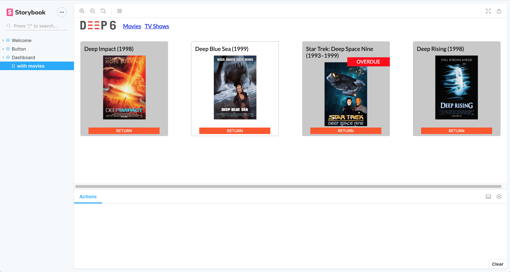

# frontend-challenge

You've received a ticket from the product team to update the look of an existing dashboard from this:


to this:


(the tile that is white is where the cursor is hovering over)

In addition to creating this new look, they would like to add the following UX and UI improvements:

- The tiles should be evenly spaced within the dashboard
- When a user resizes the page, the tiles should wrap to the next row.
- When the page width <300 pxs, the nav bar should turn into a hamburger nav.
- Update the font to use google's Lato font.
- Once a movie has been checked out for 6 days, it is overdue. Give user feedback and add a red tag to the tile saying "OVERDUE" (see mock).
- The dashboard should look and function the same on: Chrome, Firefox, MS Edge, and IE11.

The engineering team would also ike to take this opportunity to refactor the code where possible to include modular, reusable components with organized styling. To modernize the codebase, use ES6 wherever possible.

Other information:

- Please continue to work in the Storybook sandbox. To get the environment started, run:
`yarn install`, then `yarn run storybook`.

- We will provide you with a json of a user's checked out movies. The json will be an array of movie objects that look like:

```
{
    'Title': string,
    'Year': number,
    'imdbID': string,
    'checkedOut': string, //UTC time
    'Poster': string //url
}
```

- Don't worry about the functionality of the navbar links or the "Return" button. Thoes are currently view only.
